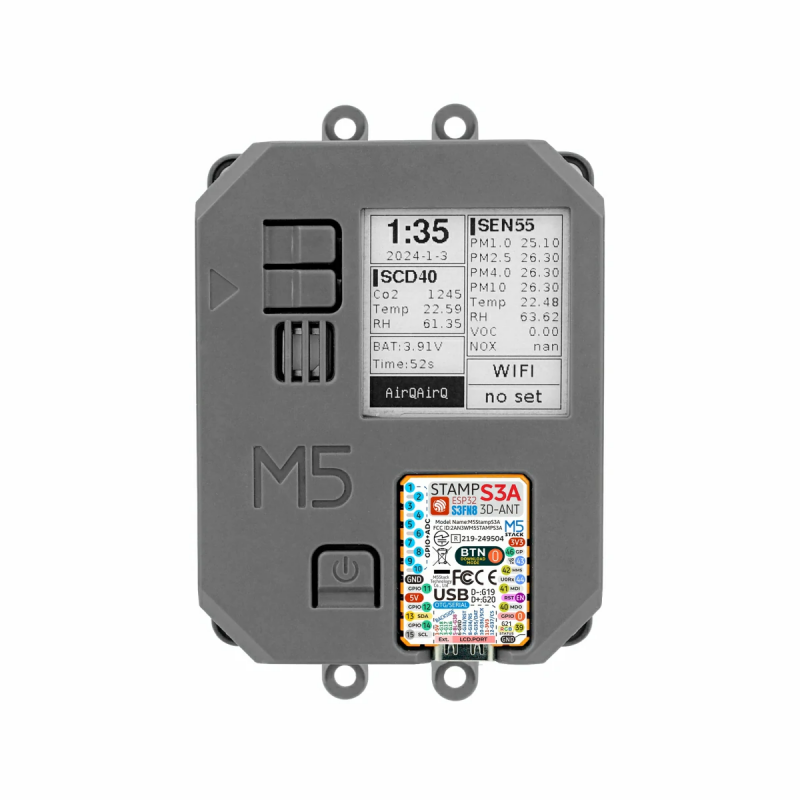

# AirQ_json_parse




The code picks up the raw feed from the ezdata/M5Stack website and parses it, sending data to a Meshtastic node via HTTP (Serial is also possible, but not implemented yet).

It sends two packets, one for SEN55, one for SCD40, separated by 30 seconds.

You need a `secrets.py` file with:

```python
aiqRefNUM = "XXXXXXXXXXX"
ipAddress = '10.0.1.x'
```